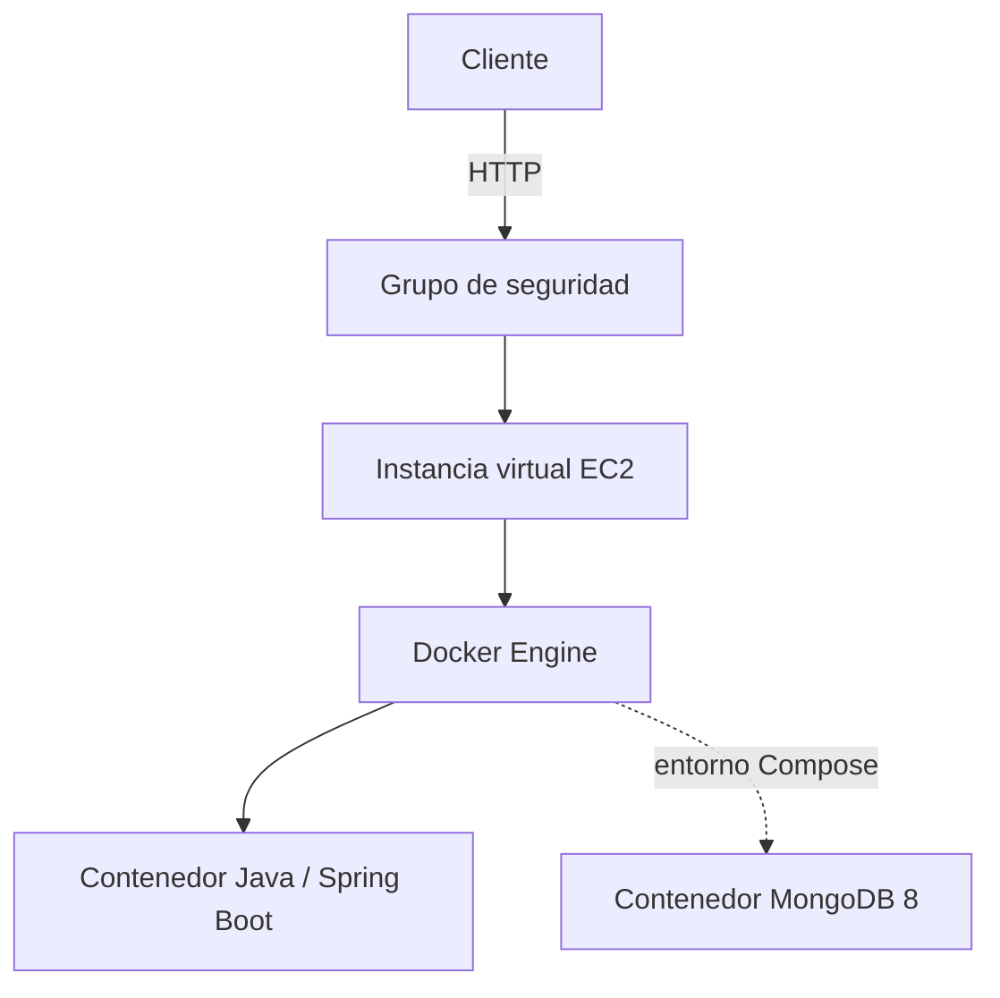
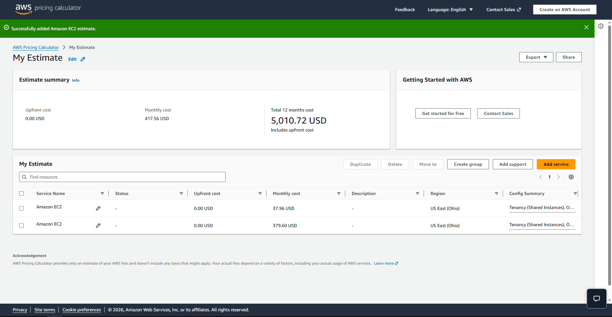

# Containerizing and Deploying a Java Web Application

Implementación del **Repositorio 1: Workshop implementation** descrito en [Instrucciones.txt](Instrucciones.txt). Este proyecto construye una API REST mínima con Spring Boot, la ejecuta en Docker y define un entorno de varios contenedores con Docker Compose.


## Contenido

- [Requisitos](#requisitos)
- [Aplicación](#aplicación)
- [Ejecución local](#ejecución-local)
- [Docker](#docker)
- [Docker Compose](#docker-compose)
- [Publicar en Docker Hub](#publicar-en-docker-hub)
- [Despliegue en AWS EC2](#despliegue-en-aws-ec2)
- [Arquitectura y costos](#arquitectura-y-costos)
- [Evidencias](#evidencias)

## Requisitos

- Java 21
- Maven 3.9 o posterior
- Docker Desktop con Docker Compose v2
- Cuenta de Docker Hub para publicar la imagen
- Cuenta de AWS con permisos para crear una instancia EC2 (solo para el despliegue)

## Aplicación

La aplicación expone `GET /greeting`. El parámetro `name` es opcional y su valor predeterminado es `World`.

| Solicitud | Respuesta |
|---|---|
| `/greeting?name=Pedro` | `Hello, Pedro!` |
| `/greeting` | `Hello, World!` |

El puerto se toma de la variable de entorno `PORT`; cuando no está definida, la aplicación usa `9000`.

## Ejecución local

Desde la raíz del proyecto, compila y ejecuta:

```bash
mvn clean package
java -jar target/virtualization-lab-1.0.0.jar
```

Prueba el endpoint en [http://localhost:9000/greeting?name=Pedro](http://localhost:9000/greeting?name=Pedro). Para elegir otro puerto:

```bash
# Linux / macOS
PORT=9100 java -jar target/virtualization-lab-1.0.0.jar
```

```powershell
# Windows PowerShell
$env:PORT = "9100"
java -jar target/virtualization-lab-1.0.0.jar
```

## Docker

El `dockerfile` de la raíz usa Amazon Corretto 21 y espera que el JAR ya esté compilado. Construye el proyecto y luego la imagen (sustituye `<usuario-dockerhub>` por tu usuario):

```bash
mvn clean package
docker build -t <usuario-dockerhub>/virtualization-lab:1.0 -f dockerfile --load .
```

> En builds recientes de Docker Desktop, el driver `docker-container` no carga la imagen al motor local automáticamente; usa `--load` para poder correrla con `docker run`.

Ejecuta un contenedor con el puerto local `34000`:

```bash
docker run -d --name virtualization-lab-1 \
  -e PORT=9000 -p 34000:9000 \
  <usuario-dockerhub>/virtualization-lab:1.0
```

Verifica con [http://localhost:34000/greeting?name=Container](http://localhost:34000/greeting?name=Container) y revisa el estado con `docker ps` o los registros con `docker logs virtualization-lab-1`.

Para demostrar instancias aisladas, inicia otras con nombres y puertos distintos:

```bash
docker run -d --name virtualization-lab-2 -p 34001:9000 <usuario-dockerhub>/virtualization-lab:1.0
docker run -d --name virtualization-lab-3 -p 34002:9000 <usuario-dockerhub>/virtualization-lab:1.0
```

Prueba [http://localhost:34001/greeting?name=Container2](http://localhost:34001/greeting?name=Container2) y [http://localhost:34002/greeting?name=Container3](http://localhost:34002/greeting?name=Container3). Al terminar, elimina los contenedores con:

```bash
docker rm -f virtualization-lab-1 virtualization-lab-2 virtualization-lab-3
```

## Docker Compose

`compose.yaml` define dos servicios: `web` (esta API, disponible en el puerto local `8087`) y `db` (MongoDB 8). La API de este taller no lee ni escribe datos en MongoDB; el servicio se incluye para practicar redes y volúmenes de Compose.

```bash
docker compose up -d --build
docker compose ps
docker compose logs web
```

Prueba [http://localhost:8087/greeting?name=Compose](http://localhost:8087/greeting?name=Compose). Compose conecta los servicios en una red privada; `web` puede resolver MongoDB mediante el nombre de servicio `db`. Los volúmenes `mongodb` y `mongodb_config` conservan los datos de MongoDB.

```bash
docker compose exec db mongosh
```

Dentro de `mongosh`, puedes ejecutar `show dbs`, `use workshop` y `db.messages.insertOne({ message: "Hello from Docker Compose" })`. Sal con `exit`. Para detener los servicios y conservar los volúmenes:

```bash
docker compose down
```

Para borrar también los datos persistidos, usa `docker compose down -v`.

## Publicar en Docker Hub

Inicia sesión y etiqueta la imagen con tu usuario:

```bash
docker login
docker tag <usuario-dockerhub>/virtualization-lab:1.0 <usuario-dockerhub>/virtualization-lab:latest
docker push <usuario-dockerhub>/virtualization-lab:1.0
docker push <usuario-dockerhub>/virtualization-lab:latest
```

**Repositorio de Docker Hub:** [hub.docker.com/r/carlosavellaneda1/virtualization-lab](https://hub.docker.com/r/carlosavellaneda1/virtualization-lab)

## Despliegue en AWS EC2

El taller propone una instancia Amazon Linux 2023. En el grupo de seguridad, permite SSH (22) solo desde tu IP y abre el puerto de la aplicación únicamente a los clientes que deban acceder. Instala Docker y habilítalo:

```bash
sudo yum update -y
sudo yum install -y docker
sudo service docker start
sudo usermod -a -G docker ec2-user
```

Cierra la sesión SSH y vuelve a conectarte para aplicar la pertenencia al grupo. Después, desde la instancia:

```bash
docker pull <usuario-dockerhub>/virtualization-lab:1.0
docker run -d --name virtualization-lab --restart unless-stopped \
  -e PORT=9000 -p 8080:9000 \
  <usuario-dockerhub>/virtualization-lab:1.0
docker ps
docker logs virtualization-lab
```

Comprueba `http://<ip-publica-ec2>:8080/greeting?name=AWS`. **URL pública del despliegue:** [http://13.222.159.181:8080/greeting](http://13.222.159.181:8080/greeting) *(activa mientras la instancia EC2 permanezca encendida; el navegador marcará el sitio como "no seguro" porque el tráfico va sin TLS, lo cual es esperado en este taller)*.

Detén o termina la instancia cuando ya no la necesites para evitar cargos.

## Arquitectura y costos



- **EC2:** proporciona cómputo, memoria, almacenamiento y conectividad de red.
- **Grupo de seguridad:** controla el tráfico entrante permitido a la instancia.
- **Docker Engine y contenedores:** ejecutan la aplicación aislada y, en Compose, MongoDB.
- **Aplicación:** procesa solicitudes HTTP en `/greeting`.

Una instancia EC2 encendida durante todo el mes genera un costo base aunque reciba pocas solicitudes; también se deben considerar EBS y transferencia de datos. El costo promedio por solicitud puede bajar al distribuir ese costo fijo entre más solicitudes, pero el punto depende de la región, el tipo de instancia, el tiempo encendida y el tráfico.

### Estimación mensual

Se generó una primera estimación en la AWS Pricing Calculator para una sola instancia EC2 encendida de forma continua en **US East (Ohio)**: **3.80 USD/mes** (45.60 USD a 12 meses), únicamente por cómputo EC2. Esta cifra aún no incluye EBS ni transferencia de datos salientes, y todavía debe replicarse ajustando el número de instancias para el escenario de carga grande.

| Escenario | Solicitudes/mes | Región, instancia y horas | Costo mensual | Costo/solicitud | Principales supuestos |
|---|---:|---|---:|---:|---|
| Pequeño | 10.000 | US East (Ohio), 1× t3.micro, 730 h/mes | ≈ 3.80 USD (solo EC2; falta sumar EBS y transferencia) | ≈ 0.00038 USD | Tráfico bajo e intermitente; una sola instancia cubre la demanda sin problema |
| Mediano | 100.000 | US East (Ohio), 1× t3.micro, 730 h/mes | ≈ 3.80 USD (solo EC2; falta sumar EBS y transferencia) | ≈ 0.000038 USD | Misma instancia que el escenario pequeño; el costo fijo se diluye entre más solicitudes |
| Grande | 1.000.000 | Pendiente (probablemente 2× instancias por capacidad/disponibilidad) | Pendiente | Pendiente | Requiere reestimar con más de una instancia, EBS ampliado y transferencia de salida real |

Calcula cada valor como `costo mensual de infraestructura / solicitudes mensuales`. **Pendiente antes de la entrega final:** agregar EBS (tamaño de disco) y transferencia de datos como líneas separadas en la calculadora, generar una estimación específica para el escenario grande con más de una instancia, y adjuntar la exportación (captura o PDF/CSV) de cada una.

Un solo EC2 tiene costos fijos incluso con poco tráfico. Varias instancias podrían ser necesarias si una instancia ya no satisface la capacidad, disponibilidad o tolerancia a fallos requeridas; un despliegue de producción también puede necesitar balanceador, base de datos administrada, monitoreo, respaldos y registro de imágenes. Para tráfico pequeño e intermitente, una opción serverless podría reducir el costo de cómputo ocioso; la comparación depende de la duración y frecuencia de las solicitudes, además de los servicios auxiliares.

**Conclusión de costos:** con base en la estimación parcial actual (solo cómputo EC2), el costo por solicitud cae de forma notable entre el escenario pequeño y el mediano al mantener la misma instancia, lo que confirma que el costo fijo de EC2 se diluye con más tráfico. La conclusión final —incluyendo si EC2 sigue siendo apropiado para el escenario grande frente a alternativas serverless— queda pendiente hasta completar EBS, transferencia y el escalamiento a más instancias.

## Evidencias

| # | Descripción | Archivo |
|---|---|---|
| 1 | Contenedor local `virtualization-lab-1` respondiendo en el puerto 34000 (`/greeting?name=Carlos`) |  |
| 2 | Aislamiento entre contenedores: `virtualization-lab-2` respondiendo de forma independiente en el puerto 34001 (`/greeting?name=Andres`) |  |
| 3 | Aislamiento entre contenedores: `virtualization-lab-3` respondiendo de forma independiente en el puerto 34002 (`/greeting?name=Avellaneda`) |  |
| 4 | Docker Desktop mostrando los tres contenedores (`virtualization-lab-1`, `-2`, `-3`) corriendo simultáneamente desde la misma imagen |  |
| 5 | Entorno multi-contenedor levantado con Docker Compose, respondiendo en el puerto 8087 (`/greeting?name=Compose`) |  |
| 6 | Repositorio `carlosavellaneda1/virtualization-lab` publicado y visible en Docker Hub |  |
| 7 | Aplicación desplegada y respondiendo desde la instancia EC2 en `13.222.159.181:8080` (`/greeting?name=AWS`) |  |
| 8 | Estimación de la AWS Pricing Calculator: instancia EC2 en US East (Ohio), 3.80 USD/mes |  |
