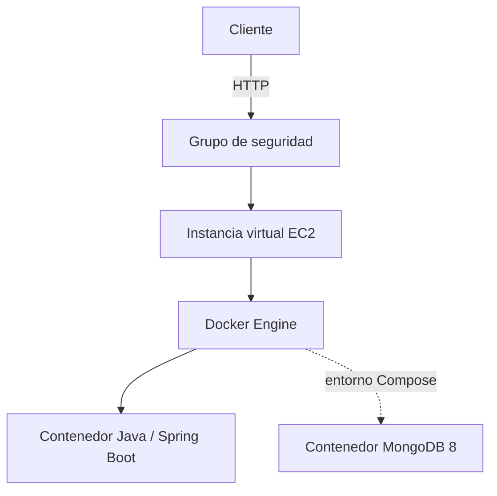

# Containerizing and Deploying a Java Web Application

Implementación del **Repositorio 1: Workshop implementation** descrito en [Instrucciones.txt](Instrucciones.txt). Este proyecto construye una API REST mínima con Spring Boot, la ejecuta en Docker y define un entorno de varios contenedores con Docker Compose.

> El alcance de este repositorio es la implementación del taller con Spring Boot. La extensión del framework propio corresponde al Repositorio 2 y no forma parte de este proyecto.

## Contenido

- [Requisitos](#requisitos)
- [Aplicación](#aplicación)
- [Ejecución local](#ejecución-local)
- [Docker](#docker)
- [Docker Compose](#docker-compose)
- [Publicar en Docker Hub](#publicar-en-docker-hub)
- [Despliegue en AWS EC2](#despliegue-en-aws-ec2)
- [Arquitectura y costos](#arquitectura-y-costos)
- [Evidencias](#evidencias)

## Requisitos

- Java 21
- Maven 3.9 o posterior
- Docker Desktop con Docker Compose v2
- Cuenta de Docker Hub para publicar la imagen
- Cuenta de AWS con permisos para crear una instancia EC2 (solo para el despliegue)

## Aplicación

La aplicación expone `GET /greeting`. El parámetro `name` es opcional y su valor predeterminado es `World`.

| Solicitud | Respuesta |
|---|---|
| `/greeting?name=Pedro` | `Hello, Pedro!` |
| `/greeting` | `Hello, World!` |

El puerto se toma de la variable de entorno `PORT`; cuando no está definida, la aplicación usa `9000`.

## Ejecución local

Desde la raíz del proyecto, compila y ejecuta:

```bash
mvn clean package
java -jar target/virtualization-lab-1.0.0.jar
```

Prueba el endpoint en [http://localhost:9000/greeting?name=Pedro](http://localhost:9000/greeting?name=Pedro). Para elegir otro puerto:

```bash
# Linux / macOS
PORT=9100 java -jar target/virtualization-lab-1.0.0.jar
```

```powershell
# Windows PowerShell
$env:PORT = "9100"
java -jar target/virtualization-lab-1.0.0.jar
```

## Docker

El `dockerfile` de la raíz usa Amazon Corretto 21 y espera que el JAR ya esté compilado. Construye el proyecto y luego la imagen (sustituye `<usuario-dockerhub>` por tu usuario):

```bash
mvn clean package
docker build -t <usuario-dockerhub>/virtualization-lab:1.0 -f dockerfile .
```

Ejecuta un contenedor con el puerto local `34000`:

```bash
docker run -d --name virtualization-lab-1 \
  -e PORT=9000 -p 34000:9000 \
  <usuario-dockerhub>/virtualization-lab:1.0
```

Verifica con [http://localhost:34000/greeting?name=Container](http://localhost:34000/greeting?name=Container) y revisa el estado con `docker ps` o los registros con `docker logs virtualization-lab-1`.

Para demostrar instancias aisladas, inicia otras con nombres y puertos distintos:

```bash
docker run -d --name virtualization-lab-2 -p 34001:9000 <usuario-dockerhub>/virtualization-lab:1.0
docker run -d --name virtualization-lab-3 -p 34002:9000 <usuario-dockerhub>/virtualization-lab:1.0
```

Prueba [http://localhost:34001/greeting?name=Container2](http://localhost:34001/greeting?name=Container2) y [http://localhost:34002/greeting?name=Container3](http://localhost:34002/greeting?name=Container3). Al terminar, elimina los contenedores con:

```bash
docker rm -f virtualization-lab-1 virtualization-lab-2 virtualization-lab-3
```

## Docker Compose

`compose.yaml` define dos servicios: `web` (esta API, disponible en el puerto local `8087`) y `db` (MongoDB 8). La API de este taller no lee ni escribe datos en MongoDB; el servicio se incluye para practicar redes y volúmenes de Compose.

```bash
docker compose up -d --build
docker compose ps
docker compose logs web
```

Prueba [http://localhost:8087/greeting?name=Compose](http://localhost:8087/greeting?name=Compose). Compose conecta los servicios en una red privada; `web` puede resolver MongoDB mediante el nombre de servicio `db`. Los volúmenes `mongodb` y `mongodb_config` conservan los datos de MongoDB.

```bash
docker compose exec db mongosh
```

Dentro de `mongosh`, puedes ejecutar `show dbs`, `use workshop` y `db.messages.insertOne({ message: "Hello from Docker Compose" })`. Sal con `exit`. Para detener los servicios y conservar los volúmenes:

```bash
docker compose down
```

Para borrar también los datos persistidos, usa `docker compose down -v`.

## Publicar en Docker Hub

Inicia sesión y etiqueta la imagen con tu usuario:

```bash
docker login
docker tag <usuario-dockerhub>/virtualization-lab:1.0 <usuario-dockerhub>/virtualization-lab:latest
docker push <usuario-dockerhub>/virtualization-lab:1.0
docker push <usuario-dockerhub>/virtualization-lab:latest
```

**Repositorio de Docker Hub:** pendiente de agregar la URL pública.

## Despliegue en AWS EC2

El taller propone una instancia Amazon Linux 2023. En el grupo de seguridad, permite SSH (22) solo desde tu IP y abre el puerto de la aplicación únicamente a los clientes que deban acceder. Instala Docker y habilítalo:

```bash
sudo yum update -y
sudo yum install -y docker
sudo service docker start
sudo usermod -a -G docker ec2-user
```

Cierra la sesión SSH y vuelve a conectarte para aplicar la pertenencia al grupo. Después, desde la instancia:

```bash
docker pull <usuario-dockerhub>/virtualization-lab:1.0
docker run -d --name virtualization-lab --restart unless-stopped \
  -e PORT=9000 -p 8080:9000 \
  <usuario-dockerhub>/virtualization-lab:1.0
docker ps
docker logs virtualization-lab
```

Comprueba `http://<dns-publico-ec2>:8080/greeting?name=AWS`. **URL pública del despliegue:** pendiente de agregar. Detén o termina la instancia cuando ya no la necesites para evitar cargos.

## Arquitectura y costos



- **EC2:** proporciona cómputo, memoria, almacenamiento y conectividad de red.
- **Grupo de seguridad:** controla el tráfico entrante permitido a la instancia.
- **Docker Engine y contenedores:** ejecutan la aplicación aislada y, en Compose, MongoDB.
- **Aplicación:** procesa solicitudes HTTP en `/greeting`.

Una instancia EC2 encendida durante todo el mes genera un costo base aunque reciba pocas solicitudes; también se deben considerar EBS y transferencia de datos. El costo promedio por solicitud puede bajar al distribuir ese costo fijo entre más solicitudes, pero el punto depende de la región, el tipo de instancia, el tiempo encendida y el tráfico.

### Estimación mensual

La guía solicita comparar 10.000, 100.000 y 1.000.000 solicitudes al mes. Aún no se ha agregado una exportación de AWS Pricing Calculator ni datos verificados para completar los importes; no se incluyen cifras estimadas como si fueran cotizaciones.

| Escenario | Solicitudes/mes | Región, instancia y horas | Costo mensual | Costo/solicitud | Principales supuestos |
|---|---:|---|---:|---:|---|
| Pequeño | 10.000 | Pendiente | Pendiente | Pendiente | EBS, transferencia, tamaño de solicitud/respuesta y disponibilidad por definir |
| Mediano | 100.000 | Pendiente | Pendiente | Pendiente | EBS, transferencia, tamaño de solicitud/respuesta y disponibilidad por definir |
| Grande | 1.000.000 | Pendiente | Pendiente | Pendiente | Capacidad, transferencia, escalamiento y alta disponibilidad por definir |

Calcula cada valor como `costo mensual de infraestructura / solicitudes mensuales`. La estimación final debe incluir EC2, EBS y transferencia de salida, junto con región, tipo y número de instancias, horas mensuales, almacenamiento, transferencia esperada y tamaños promedio de solicitud/respuesta. Adjunta la captura o exportación de Pricing Calculator cuando esté disponible.

Un solo EC2 tiene costos fijos incluso con poco tráfico. Varias instancias podrían ser necesarias si una instancia ya no satisface la capacidad, disponibilidad o tolerancia a fallos requeridas; un despliegue de producción también puede necesitar balanceador, base de datos administrada, monitoreo, respaldos y registro de imágenes. Para tráfico pequeño e intermitente, una opción serverless podría reducir el costo de cómputo ocioso; la comparación depende de la duración y frecuencia de las solicitudes, además de los servicios auxiliares. La elección requiere los supuestos y precios concretos de la región.

**Conclusión de costos:** pendiente hasta definir supuestos de carga y región, y adjuntar el cálculo verificable.

## Evidencias

Las imágenes siguientes se conservan en el repositorio como evidencias visuales del desarrollo del taller. Añade pies de foto precisos y confirma qué demuestra cada captura antes de la entrega final.

| Captura | Archivo |
|---|---|
| 1 |  |
| 2 |  |
| 3 |  |
| 4 |  |
| 5 |  |
| 6 |  |
| 7 |  |
| 8 |  |

Para completar los entregables del Repositorio 1, agrega la URL del repositorio de Docker Hub, la URL pública de EC2 (si la instancia sigue activa), una descripción verificable por captura, y el cálculo de costos junto con sus supuestos. El video de demostración local y en EC2 también se entrega según las instrucciones del taller.

