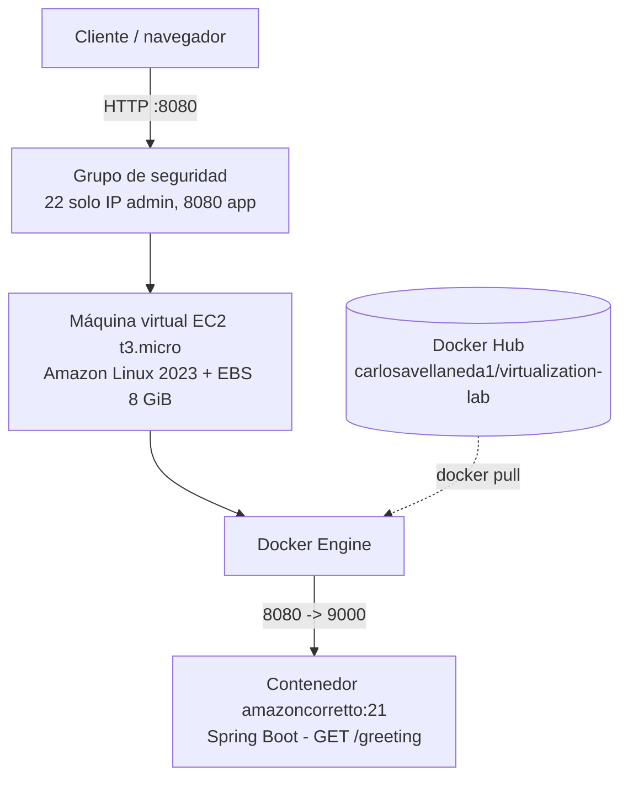
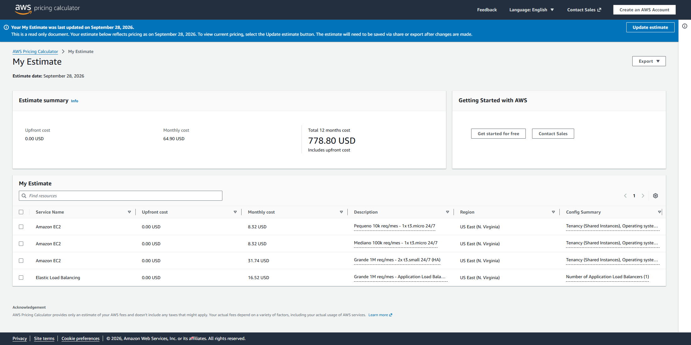
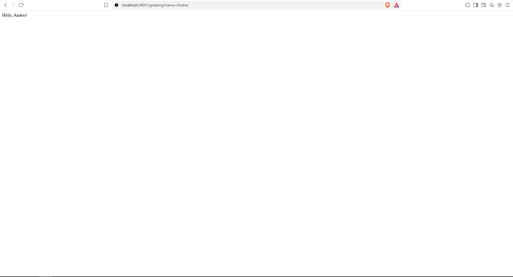
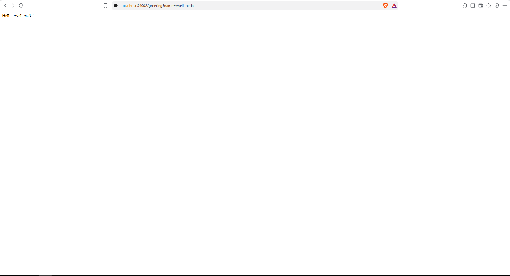
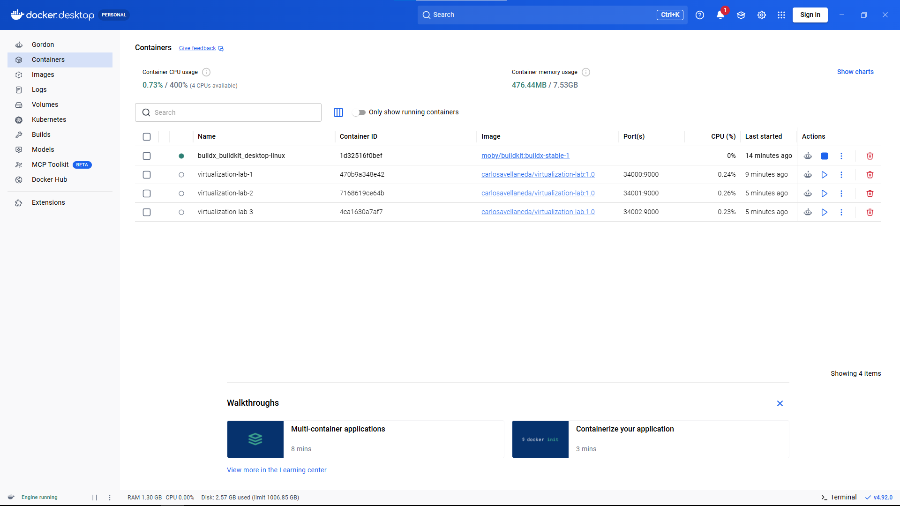
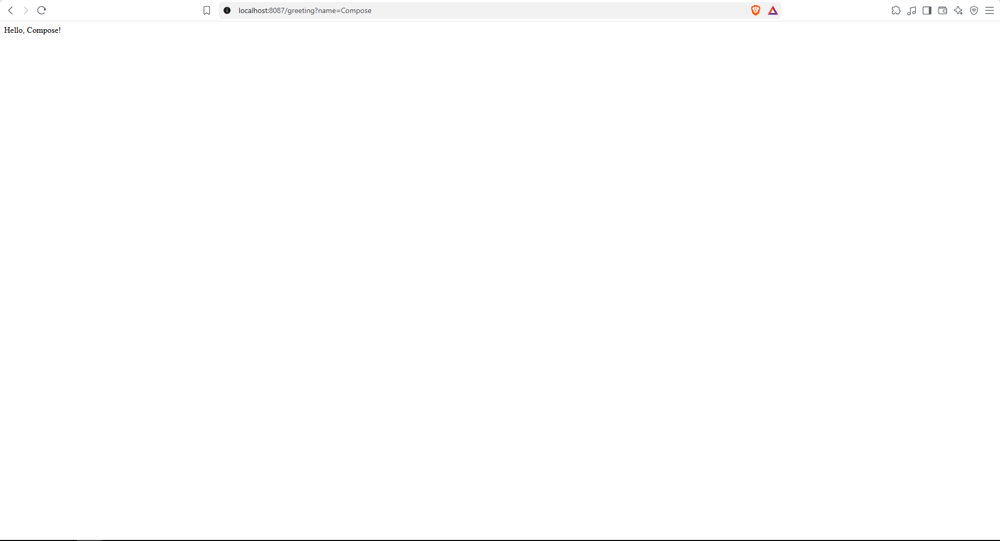
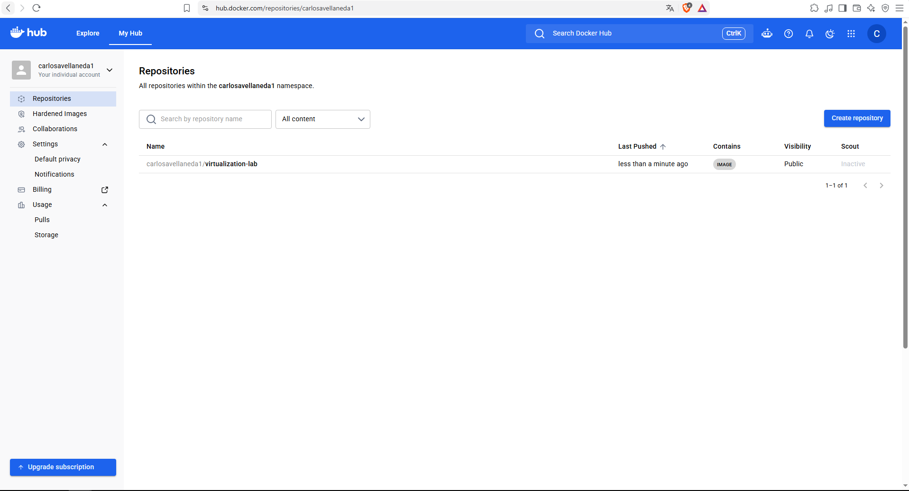
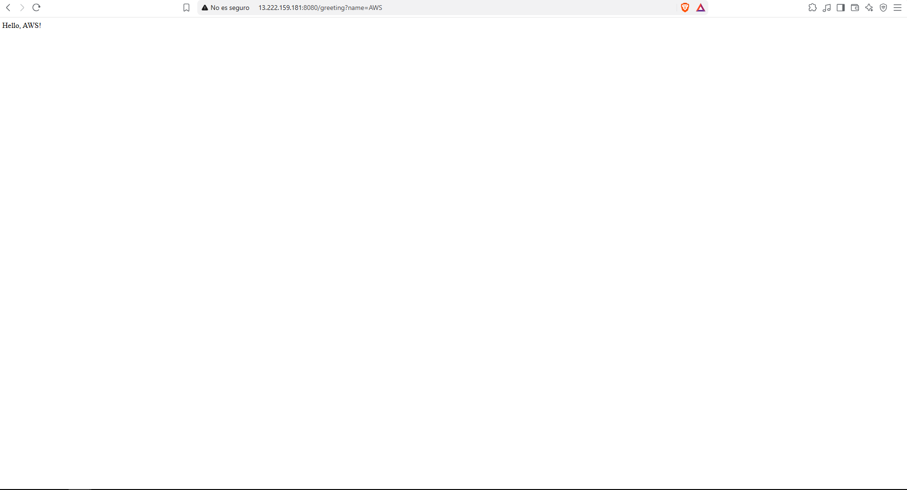
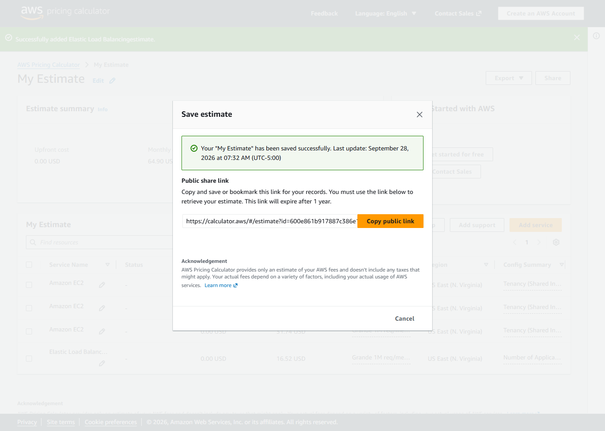
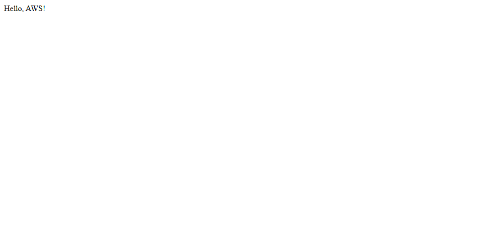

# Containerizing and Deploying a Java Web Application

Implementación del **Repositorio 1: Workshop implementation**. Este proyecto construye una API REST mínima con Spring Boot 4.1.1 y Java 21, la empaqueta en una imagen Docker basada en Amazon Corretto 21, define un entorno de varios contenedores con Docker Compose, publica la imagen en Docker Hub y la despliega en una instancia AWS EC2 con Amazon Linux 2023.

| Recurso | Enlace |
|---|---|
| Imagen en Docker Hub | [hub.docker.com/r/carlosavellaneda1/virtualization-lab](https://hub.docker.com/r/carlosavellaneda1/virtualization-lab) |
| Despliegue público (EC2) | [http://54.90.132.138:8080/greeting?name=AWS](http://54.90.132.138:8080/greeting?name=AWS) |
| Repositorio 2 (extensión del framework) | [Framework-extension](https://github.com/Carlos-Avellaneda-2/Containerizing-and-Deploying-a-Java-Web-Application-Framework-extension) |


## Contenido

- [Requisitos](#requisitos)
- [Aplicación](#aplicación)
- [Ejecución local](#ejecución-local)
- [Docker](#docker)
- [Docker Compose](#docker-compose)
- [Publicar en Docker Hub](#publicar-en-docker-hub)
- [Despliegue en AWS EC2](#despliegue-en-aws-ec2)
- [Arquitectura y costos](#arquitectura-y-costos)
- [Evidencias](#evidencias)

## Requisitos

- Java 21
- Maven 3.9 o posterior
- Docker Desktop con Docker Compose v2
- Cuenta de Docker Hub para publicar la imagen
- Cuenta de AWS con permisos para crear una instancia EC2 (solo para el despliegue)

## Aplicación

La aplicación expone `GET /greeting`. El parámetro `name` es opcional y su valor predeterminado es `World`.

| Solicitud | Respuesta |
|---|---|
| `/greeting?name=Pedro` | `Hello, Pedro!` |
| `/greeting` | `Hello, World!` |

El puerto se toma de la variable de entorno `PORT`; cuando no está definida, la aplicación usa `9000`.

## Ejecución local

Desde la raíz del proyecto, compila y ejecuta:

```bash
mvn clean package
java -jar target/virtualization-lab-1.0.0.jar
```

Prueba el endpoint en [http://localhost:9000/greeting?name=Pedro](http://localhost:9000/greeting?name=Pedro). Para elegir otro puerto:

```bash
# Linux / macOS
PORT=9100 java -jar target/virtualization-lab-1.0.0.jar
```

```powershell
# Windows PowerShell
$env:PORT = "9100"
java -jar target/virtualization-lab-1.0.0.jar
```

## Docker

El `Dockerfile` de la raíz usa Amazon Corretto 21 y espera que el JAR ya esté compilado:

```dockerfile
FROM amazoncorretto:21
WORKDIR /app
COPY target/*.jar app.jar
ENV PORT=9000
EXPOSE 9000
ENTRYPOINT ["java", "-jar", "app.jar"]
```

Construye el proyecto y luego la imagen (sustituye `<usuario-dockerhub>` por tu usuario):

```bash
mvn clean package
docker build -t <usuario-dockerhub>/virtualization-lab:1.0 --load .
docker images
```

> En builds recientes de Docker Desktop, el driver `docker-container` no carga la imagen al motor local automáticamente; usa `--load` para poder correrla con `docker run`.

Ejecuta un contenedor con el puerto local `34000`:

```bash
docker run -d --name virtualization-lab-1 \
  -e PORT=9000 -p 34000:9000 \
  <usuario-dockerhub>/virtualization-lab:1.0
```

Verifica con [http://localhost:34000/greeting?name=Container](http://localhost:34000/greeting?name=Container) y revisa el estado con `docker ps` o los registros con `docker logs virtualization-lab-1`.

Para demostrar instancias aisladas, inicia otras con nombres y puertos distintos:

```bash
docker run -d --name virtualization-lab-2 -p 34001:9000 <usuario-dockerhub>/virtualization-lab:1.0
docker run -d --name virtualization-lab-3 -p 34002:9000 <usuario-dockerhub>/virtualization-lab:1.0
```

Prueba [http://localhost:34001/greeting?name=Container2](http://localhost:34001/greeting?name=Container2) y [http://localhost:34002/greeting?name=Container3](http://localhost:34002/greeting?name=Container3). Al terminar, elimina los contenedores con:

```bash
docker rm -f virtualization-lab-1 virtualization-lab-2 virtualization-lab-3
```

## Docker Compose

`compose.yaml` define dos servicios: `web` (esta API, disponible en el puerto local `8087`) y `db` (MongoDB 8). La API de este taller no lee ni escribe datos en MongoDB; el servicio se incluye para practicar redes y volúmenes de Compose.

```bash
docker compose up -d --build
docker compose ps
docker compose logs web
```

Prueba [http://localhost:8087/greeting?name=Compose](http://localhost:8087/greeting?name=Compose). Compose conecta los servicios en una red privada; `web` puede resolver MongoDB mediante el nombre de servicio `db`. Los volúmenes `mongodb` y `mongodb_config` conservan los datos de MongoDB.

```bash
docker compose exec db mongosh
```

Dentro de `mongosh`, puedes ejecutar `show dbs`, `use workshop` y `db.messages.insertOne({ message: "Hello from Docker Compose" })`. Sal con `exit`. Para detener los servicios y conservar los volúmenes:

```bash
docker compose down
```

Para borrar también los datos persistidos, usa `docker compose down -v`.

## Publicar en Docker Hub

Inicia sesión y etiqueta la imagen con tu usuario:

```bash
docker login
docker tag <usuario-dockerhub>/virtualization-lab:1.0 <usuario-dockerhub>/virtualization-lab:latest
docker push <usuario-dockerhub>/virtualization-lab:1.0
docker push <usuario-dockerhub>/virtualization-lab:latest
```

**Repositorio de Docker Hub:** [hub.docker.com/r/carlosavellaneda1/virtualization-lab](https://hub.docker.com/r/carlosavellaneda1/virtualization-lab)

## Despliegue en AWS EC2

El taller propone una instancia Amazon Linux 2023. En el grupo de seguridad, permite SSH (22) solo desde tu IP y abre el puerto de la aplicación únicamente a los clientes que deban acceder. Instala Docker y habilítalo:

```bash
sudo yum update -y
sudo yum install -y docker
sudo service docker start
sudo usermod -a -G docker ec2-user
```

Cierra la sesión SSH y vuelve a conectarte para aplicar la pertenencia al grupo. Después, desde la instancia:

```bash
docker pull <usuario-dockerhub>/virtualization-lab:1.0
docker run -d --name virtualization-lab --restart unless-stopped \
  -e PORT=9000 -p 8080:9000 \
  <usuario-dockerhub>/virtualization-lab:1.0
docker ps
docker logs virtualization-lab
```

Comprueba `http://<ip-publica-ec2>:8080/greeting?name=AWS`; la respuesta esperada es `Hello, AWS!`.

**URL pública del despliegue:** [http://54.90.132.138:8080/greeting?name=AWS](http://54.90.132.138:8080/greeting?name=AWS) *(activa mientras la instancia EC2 permanezca encendida; la IP pública cambia si la instancia se detiene y se vuelve a iniciar. El navegador marca el sitio como "no seguro" porque el tráfico va sin TLS, lo cual es esperado en este taller)*.

Datos de la instancia usada:

| Dato | Valor |
|---|---|
| Región | us-east-1 (N. Virginia) |
| Tipo de instancia | t3.micro (2 vCPU, 1 GiB RAM) |
| Sistema operativo | Amazon Linux 2023 |
| Disco | 8 GiB EBS |
| DNS público | `ec2-54-90-132-138.compute-1.amazonaws.com` |
| Grupo de seguridad | `launch-wizard-1`: SSH 22 desde la IP del administrador, 8080 para la aplicación |

Salida obtenida en la instancia:

```text
$ docker ps
CONTAINER ID   IMAGE                                      COMMAND               PORTS                    NAMES
588316a29927   carlosavellaneda1/virtualization-lab:1.0   "java -jar app.jar"   0.0.0.0:8080->9000/tcp   virtualization-lab

$ curl "http://localhost:8080/greeting?name=AWS"
Hello, AWS!
```

Detén o termina la instancia cuando ya no la necesites para evitar cargos.

## Arquitectura y costos

### Modelo de despliegue



```text
Cliente
  ↓ solicitud HTTP
Máquina virtual EC2
  ↓
Docker Engine
  ↓
Contenedor con la aplicación web Java
```

| Capa | Responsabilidad |
|---|---|
| **Grupo de seguridad** | Firewall virtual: decide qué tráfico entrante llega a la VM (SSH solo desde la IP del administrador y el puerto de la aplicación). |
| **Máquina virtual EC2** | Cómputo, memoria, almacenamiento (EBS) y red aislados, alquilados por hora. Es el costo fijo del despliegue. |
| **Docker Engine** | Descarga la imagen, crea el contenedor, publica el puerto `8080 -> 9000` y lo reinicia (`--restart unless-stopped`). |
| **Contenedor Docker** | Entorno portable que empaqueta la aplicación con su runtime (Amazon Corretto 21); es el mismo artefacto que se probó localmente. |
| **Aplicación Java** | Recibe las peticiones HTTP y ofrece la funcionalidad de negocio (`/greeting`). Lee su puerto de la variable `PORT`. |
| **Docker Hub** | Registro de imágenes desde el que la VM obtiene la versión a desplegar. |

En local, Docker Compose añade un segundo contenedor (MongoDB 8) en la misma red; en EC2 solo se desplegó el contenedor de la aplicación.

### Supuestos de carga

| Supuesto | Pequeño | Mediano | Grande |
|---|---|---|---|
| Solicitudes/mes | 10.000 | 100.000 | 1.000.000 |
| Promedio | ≈ 0,004 req/s | ≈ 0,04 req/s | ≈ 0,4 req/s (picos estimados de 5–10 req/s) |
| Región | us-east-1 (N. Virginia) | us-east-1 | us-east-1 |
| Tipo de instancia | t3.micro | t3.micro | t3.small |
| Número de instancias | 1 | 1 | 2 (dos zonas de disponibilidad) |
| Horas de ejecución/mes | 730 (24/7) | 730 (24/7) | 730 por instancia (24/7) |
| Almacenamiento EBS | 8 GiB gp3 | 8 GiB gp3 | 8 GiB gp3 por instancia |
| Tamaño medio solicitud + respuesta | ≈ 1 KB (≈ 0,5 KB + 0,5 KB con cabeceras HTTP) | ≈ 1 KB | ≈ 1 KB |
| Transferencia de salida estimada | ≈ 0,01 GB (se ingresa 1 GB) | ≈ 0,1 GB (se ingresa 1 GB) | ≈ 1 GB |
| Ejecución | Continua | Continua | Continua |
| Alta disponibilidad | No | No | Sí: 2 instancias + Application Load Balancer |

La aplicación es muy ligera (una respuesta de texto de pocos bytes, sin base de datos), por lo que incluso una t3.micro soporta con holgura cientos de solicitudes por segundo; la diferencia entre escenarios está en la disponibilidad exigida, no en la capacidad de CPU.

### Estimación de costos

La estimación se hizo en la **AWS Pricing Calculator**, región US East (N. Virginia), con un servicio por escenario (EC2 On-Demand al 100 % de uso, EBS gp3 de 8 GB por instancia y transferencia de salida a Internet) y un Application Load Balancer para el escenario grande.

**Estimación pública:** [calculator.aws/#/estimate?id=600e861b917887c386e1d93a8d1eabebfe9e6137](https://calculator.aws/#/estimate?id=600e861b917887c386e1d93a8d1eabebfe9e6137) (el enlace caduca a un año de su creación).



> El total de 64,90 USD/mes que muestra la calculadora es la suma de las cuatro filas; cada escenario debe leerse por separado: pequeño = fila 1, mediano = fila 2, grande = filas 3 + 4.

Desglose de precios on-demand en us-east-1:

| Concepto | Precio |
|---|---|
| EC2 t3.micro | 0,0104 USD/h → 7,59 USD/mes (730 h) |
| EC2 t3.small | 0,0208 USD/h → 15,18 USD/mes (730 h) |
| EBS gp3 | 0,08 USD por GB-mes → 0,64 USD/mes por 8 GB |
| Transferencia de salida a Internet | ≈ 0,09 USD/GB. La calculadora solo acepta GB enteros, así que se ingresó 1 GB en cada escenario (sobreestima un poco los escenarios pequeño y mediano) |
| Application Load Balancer | 0,0225 USD/h → 16,43 USD/mes + LCU (≈ 0,09 USD/mes con 0,4 conexiones nuevas/s, 1 GB/mes procesado) |

| Escenario | Solicitudes/mes | Costo mensual de infraestructura | Costo estimado por solicitud | Principales impulsores de costo |
|---|---:|---:|---:|---|
| Pequeño | 10.000 | **8,32 USD** (7,59 EC2 + 0,64 EBS + 0,09 transferencia) | 8,32 / 10.000 = **0,000832 USD** | Tiempo de ejecución de EC2 y almacenamiento |
| Mediano | 100.000 | **8,32 USD** (7,59 EC2 + 0,64 EBS + 0,09 transferencia) | 8,32 / 100.000 = **0,0000832 USD** | Tiempo de ejecución de EC2, almacenamiento y transferencia |
| Grande | 1.000.000 | **48,26 USD** (31,74 EC2 con EBS y transferencia + 16,52 ALB) | 48,26 / 1.000.000 = **0,0000483 USD** | Capacidad de las instancias, balanceador, transferencia y necesidades de escalamiento |

Fórmula: `costo estimado por solicitud = costo mensual de infraestructura / solicitudes mensuales`.

La transferencia de datos es despreciable frente al cómputo en los tres escenarios (y AWS incluye 100 GB/mes gratuitos de salida por cuenta, que la calculadora no descuenta). No se incluyen impuestos, IPv4 pública (0,005 USD/h si se cobra en la cuenta), ni la capa gratuita de EC2.

### Discusión de arquitectura

**¿Por qué un despliegue en EC2 tiene un costo mensual base aunque reciba pocas solicitudes?**
Porque EC2 se cobra por **tiempo de instancia encendida**, no por solicitud. La VM reserva vCPU, memoria y disco las 730 horas del mes aunque esté casi siempre ociosa; el disco EBS se cobra por GB aprovisionado aunque no se use. En el escenario pequeño la instancia pasa más del 99,9 % del tiempo sin trabajo, pero el costo es el mismo que con 100.000 solicitudes.

**¿En qué nivel de carga el costo fijo pierde peso por solicitud?**
Ya en el escenario **mediano**: con la misma instancia de 8,32 USD el costo por solicitud baja 10 veces (0,000832 → 0,0000832 USD). Como una t3.micro podría atender varios millones de solicitudes al mes con esta aplicación, el costo fijo sigue diluyéndose mientras no se agregue infraestructura. En el escenario grande el costo total sube (por alta disponibilidad), pero el costo por solicitud sigue bajando (0,0000483 USD).

**¿Qué obligaría a pasar de una instancia a varias?**
- Que la CPU o la memoria de una instancia se saturen en los picos (latencia alta, errores 5xx).
- Requisitos de **alta disponibilidad**: una sola instancia es un punto único de falla (caída de la VM o de la zona de disponibilidad).
- Desplegar sin interrupción (*rolling updates*) mientras otra instancia atiende el tráfico.
- Picos de tráfico impredecibles que requieran escalamiento automático (Auto Scaling Group).

**¿Qué servicios adicionales requeriría un despliegue de producción?**
Un **Application Load Balancer** con certificado TLS (ACM) para HTTPS, un **Auto Scaling Group** en varias zonas, una **base de datos administrada** (Amazon DocumentDB o MongoDB Atlas en lugar del MongoDB en contenedor, o RDS), **monitoreo y logs** (CloudWatch métricas, alarmas y logs), **respaldos** (snapshots de EBS / backups de la base de datos), un **registro de contenedores privado** (Amazon ECR), gestión de secretos (Secrets Manager / Parameter Store), DNS (Route 53) y posiblemente WAF.

**¿Sería más económico un despliegue serverless para la carga pequeña?**
Sí. Con 10.000 solicitudes al mes la carga es **muy baja (≈ 1 solicitud cada 4 minutos) e intermitente**, y cada solicitud dura milisegundos. En serverless (AWS Lambda + API Gateway HTTP API) se paga por solicitud y por tiempo de ejecución: 10.000 invocaciones de ≈ 100 ms con 512 MB suponen ≈ 500 GB-s de cómputo y 10.000 solicitudes de API Gateway (1 USD por millón), es decir **≈ 0,02 USD al mes** (o 0 USD dentro de la capa gratuita), frente a 8,32 USD de la instancia que permanece ociosa casi todo el tiempo. La desventaja es el *cold start* de Java (mitigable con SnapStart) y adaptar la aplicación al modelo de funciones. Con carga alta y sostenida la relación se invierte: un servidor siempre ocupado resulta más barato por solicitud que pagar cada invocación.

### Conclusión

EC2 **funciona técnicamente** en los tres escenarios, pero su conveniencia económica depende de la carga. Para el escenario **pequeño** EC2 no es la opción más eficiente: se pagan 8,32 USD/mes por una máquina ociosa, cuando serverless costaría centavos. Para el escenario **mediano** EC2 con una sola t3.micro es razonable y simple, porque el costo fijo ya se reparte entre 100.000 solicitudes y la administración es mínima. Para el escenario **grande**, EC2 es apropiado si se añade alta disponibilidad (dos instancias y un balanceador), con un costo por solicitud aún menor (≈ 0,000048 USD). Para este taller, que tiene tráfico bajo, una sola instancia EC2 t3.micro es suficiente y demuestra el modelo VM + contenedor; en producción convendría evaluar serverless o contenedores administrados (ECS Fargate) según el patrón real de tráfico.

## Evidencias

| # | Descripción | Captura |
|---|---|---|
| 1 | Contenedor local `virtualization-lab-1` respondiendo en el puerto 34000 (`/greeting?name=Carlos`) |  |
| 2 | Aislamiento entre contenedores: `virtualization-lab-2` respondiendo de forma independiente en el puerto 34001 (`/greeting?name=Andres`) |  |
| 3 | Aislamiento entre contenedores: `virtualization-lab-3` respondiendo de forma independiente en el puerto 34002 (`/greeting?name=Avellaneda`) |  |
| 4 | Docker Desktop mostrando los tres contenedores (`virtualization-lab-1`, `-2`, `-3`) corriendo simultáneamente desde la misma imagen |  |
| 5 | Entorno multi-contenedor levantado con Docker Compose, respondiendo en el puerto 8087 (`/greeting?name=Compose`) |  |
| 6 | Repositorio `carlosavellaneda1/virtualization-lab` publicado y visible en Docker Hub |  |
| 7 | Aplicación desplegada y respondiendo desde una instancia EC2 (`/greeting?name=AWS`) |  |
| 8 | AWS Pricing Calculator: estimación de los tres escenarios en US East (N. Virginia) |  |
| 9 | AWS Pricing Calculator: estimación guardada con enlace público |  |
| 10 | Despliegue actual en EC2: `http://54.90.132.138:8080/greeting?name=AWS` |  |
